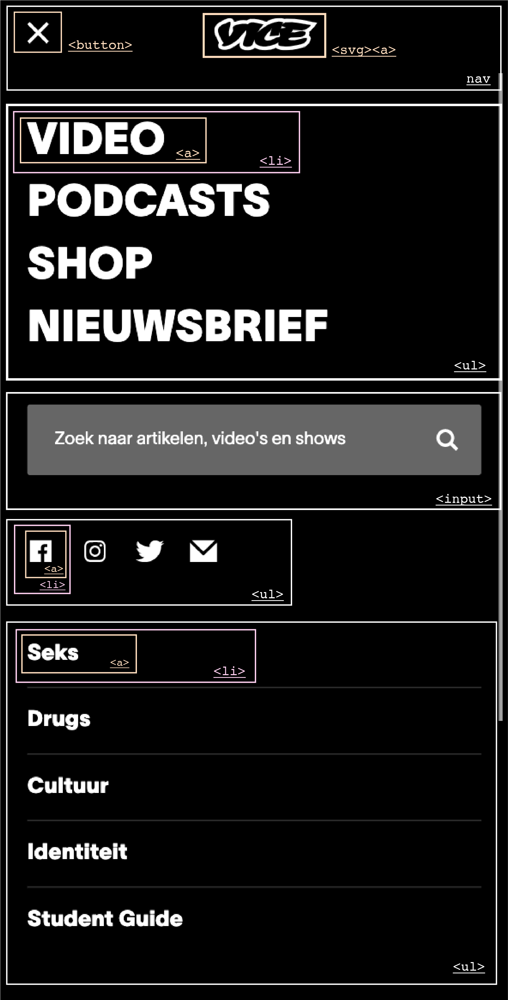

# Procesverslag
Markdown is een simpele manier om HTML te schrijven.  
Markdown cheat cheet: [Hulp bij het schrijven van Markdown](https://github.com/adam-p/markdown-here/wiki/Markdown-Cheatsheet).

Nb. De standaardstructuur en de spartaanse opmaak van de README.md zijn helemaal prima. Het gaat om de inhoud van je procesverslag. Besteedt de tijd voor pracht en praal aan je website.

Nb. Door *open* toe te voegen aan een *details* element kun je deze standaard open zetten. Fijn om dat steeds voor de relevante stuk(ken) te doen.

## Jij

uitwerken voor kick-off werkgroep

### Auteur:
Sophie Folmer

#### Je startniveau:
Blauw

#### Je focus:
Responsive
 

## Je website

Ik ga de homepagina en een detail pagina van vice.com uitwerken.

### Je opdracht:
https://www.vice.com/nl

#### Screenshot(s) van de eerste pagina (small screen): 
Home pagina Vice.com

#### Screenshot(s) van de tweede pagina (small screen):
hier de naam van de pagina  

 

## Breakdownschets (week 1)

uitwerken na afloop 2e werkgroep

### de hele pagina: 

### dynamisch deel (bijv menu): 

### wellicht nog een dynamisch deel (bijv filter): 

## Mijn proces

Ik koos voor vice.com omdat de site er mooi en verzorgd uitziet en ik veel aan de slag kon met flexbox en grid. 

Ik begon met het schrijven van de HTML en dat ging mij best goed af. Ik was gelukkig niet alles vergeten en de breakdownsheet hielp enorm.

Ik was heel lang bezig met CSS en ik vond het moeilijk om te beginnen met de mobiele versie. Ik besloot toch van groot naar klein te gaan. In mijn voortgangsgesprek kwam naar voren dat ik minder moest werken met classes. Dit was nieuw voor mij en het duurde even voordat ik onder de knie kreeg. 

Ik ben trots op het eindresultaat en zie zelf ook dat een aantal dingen wat mooier konden. Ondanks dat merkte ik dat (vooral) op het eind ik lekker kon doortypen en coderen. Ik wist uiteindelijk meer dan ik dacht en hoefde daarom ook minder op te zoeken. 

Ik heb veel kunnen leren dankzij de stof die we kregen tijdens de lessen. Via Codepen kon ik altijd even oefenen en dat hielp mij om het beter te begrijpen. Ik was ook heel blij dat ik via Google Chrome mijn fouten kon vinden en herstellen. 

Feedback

Classes

Ik gebruikte alleen maar classes om de vormgeving te veranderen. Dit kon ook anders opgelost worden door bijvoorbeeld nth-of-type te gebruiken. Dit is na mijn eerste voorrangsgesprek aangepast. 

li in nav

Ik had alleen a in mijn navigatie terwijl het mooier is om gewoon een ul te maken met daarin li items. 

geen div

Voor een aantal onderdelen gebruikte ik onnodig divjes. Ik heb dit vervangen door bijvoorbeeld section of aside. 

### Screenshot(s)

## Bronnenlijst

continu bijhouden terwijl je werkt

Nb. Wees specifiek ('css-tricks' als bron is bijv. niet specifiek genoeg).

1. https://css-tricks.com/snippets/css/a-guide-to-flexbox/
2. https://css-tricks.com/snippets/css/complete-guide-grid/
3. https://flexbox.io video's
4. https://www.youtube.com/watch?v=dIyVTjJAkLw (hamburger menu)
5. https://www.w3schools.com/html/html_form_input_types.asp
6. https://www.w3schools.com/cssref/pr_class_float.asp
7. https://www.w3schools.com/cssref/pr_border.asp
8. https://www.w3schools.com/cssref/css3_pr_font-face_rule.asp
9. https://www.w3schools.com/css/css_grid.asp

